### 1 登录

#### 1.1 功能说明

用户通过“用户名 + 密码”完成身份验证后进入系统。

#### 1.2 忘记密码

若遗忘密码，可点击“忘记密码”链接，按提示输入注册邮箱，系统将发送重置链接至该邮箱。

---

### 2 首页

侧边导航提供“家谱树、村志、家谱管理、用户管理”等功能。

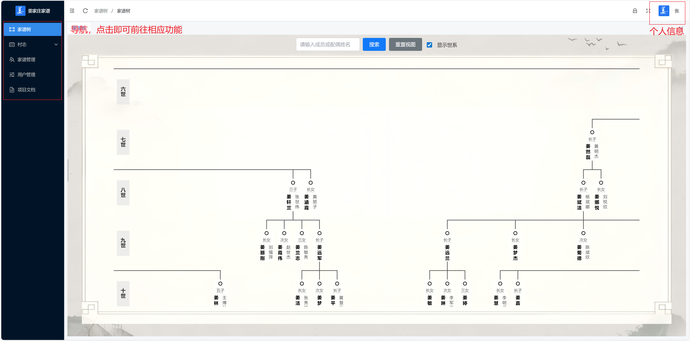

---

### 3 家谱树

#### 3.1 界面布局

- **中央区**：树状 SVG 展示家族世系，支持无极缩放与拖拽平移。
- **顶部栏**：集成“搜索、视图复位”等工具。
- **左侧签**：动态标注当前视口所在世代数（第 N 世）。

  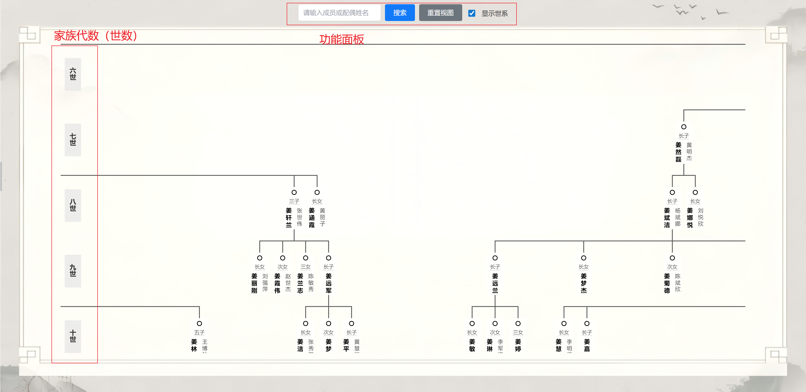

#### 3.2 交互规则

| 操作 | 触发方式             | 效果                      |
| ---- | -------------------- | ------------------------- |
| 平移 | 空白处按住左键拖动   | 画布随鼠标平移            |
| 缩放 | 滚轮向前/向后        | 以鼠标焦点为中心放大/缩小 |
| 复位 | 顶部“重置视图”按钮 | 恢复初始比例与位置        |

#### 3.3 成员详情

单击任意成员卡片 → 右侧滑出详情面板，展示姓名、生于、配偶、现居地等字段；点击“×”或画布空白处即可关闭。

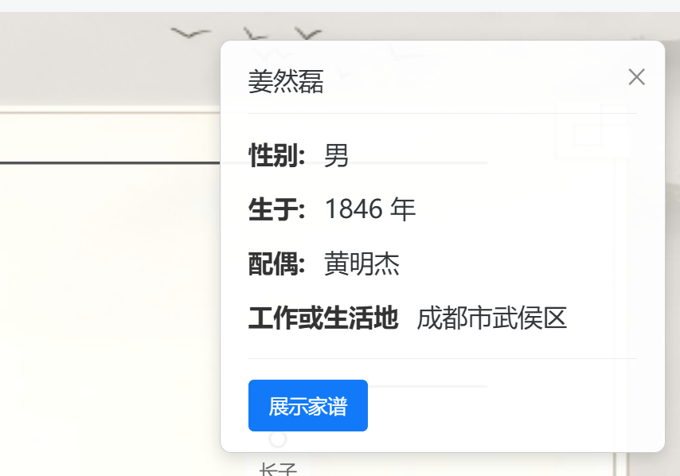

#### 3.4 家谱查看

在详情面板点击“展开家谱”，系统仅渲染该节点下延三代（子、孙、重孙）。

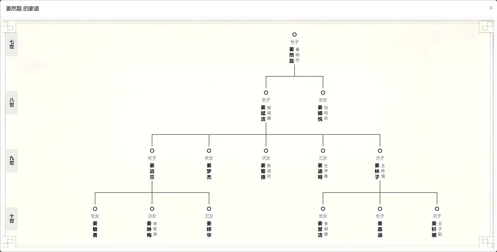

---

### 4 搜索与聚焦

#### 4.1 搜索建议

顶部搜索框支持“姓名 / 配偶姓名”模糊匹配，输入即显下拉列表。

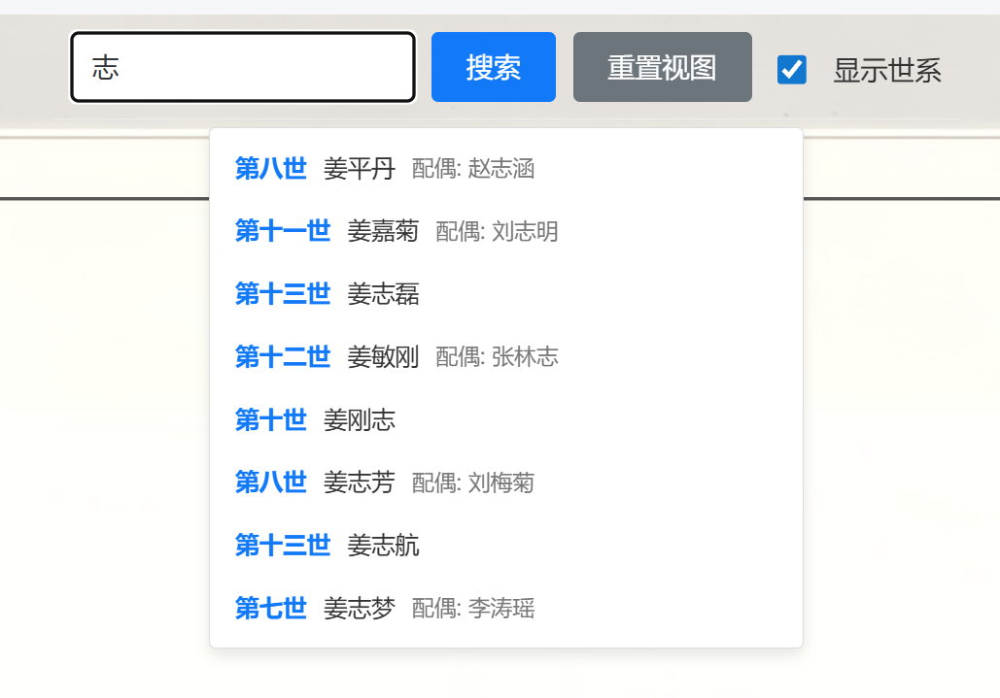

#### 4.2 搜索执行

选中建议项或回车后：

1. 视图自动平移，目标成员居中；
2. 目标卡片附加辉光高亮；
3. 向上三代血缘连线置为强调色。

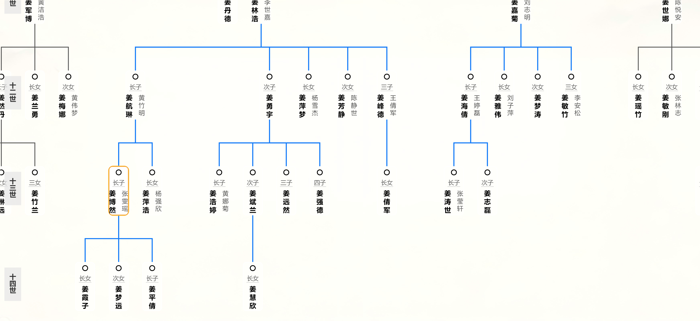

#### 4.3 视图重置

点击“重置视图”即可一键恢复初始状态，包括缩放级、位置、高亮及临时过滤。

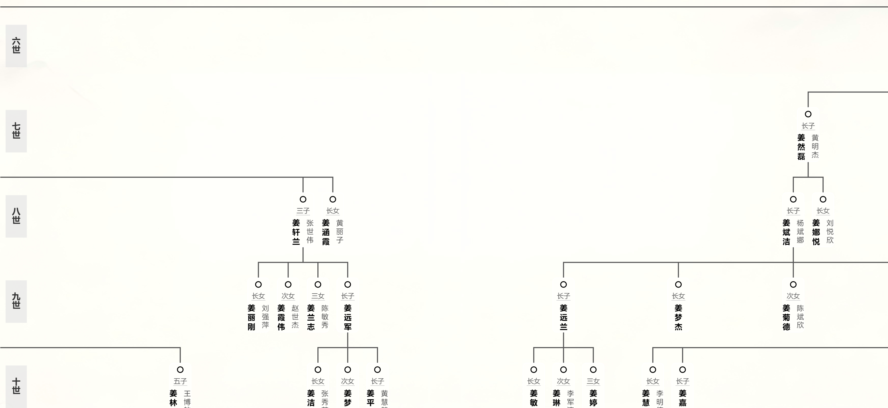

#### 4.4 视觉自适应

| 模式 | 触发条件       | 节点信息           | 布局密度 |
| ---- | -------------- | ------------------ | -------- |
| 详细 | 放大至阈值以上 | 姓名 + 配偶 + 排行 | 稀疏     |
| 简洁 | 缩小至阈值以下 | 仅姓名             | 紧密     |

---

### 5 大事纪

#### 5.1 展示规则

事件按“年-月”聚合，进入页面默认展开最近 4 个月；点击月份标题可折叠/展开。

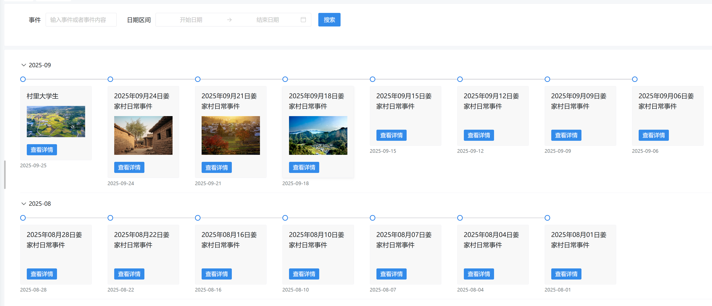

#### 5.2 检索能力

- 关键词：匹配事件标题或正文；
- 日期区间：起止日历选择；
- 组合检索：两条件同时满足时返回交集。清空条件并点击“搜索”即恢复完整列表。

搜索功能可以锁定指定事件。在其中输入关键词，只要事件名或者事件内容中包含关键词，那么就会被检索出来。也可以使用日期区间，选择指定的日期区间，会将在指定日期区间的所有事件进行展示。这两个检索可以同时使用，同时使用会展示同时满足这两个条件的所有事件。也可以单独使用某一个检索条件，另外一个检索条件不填即可。

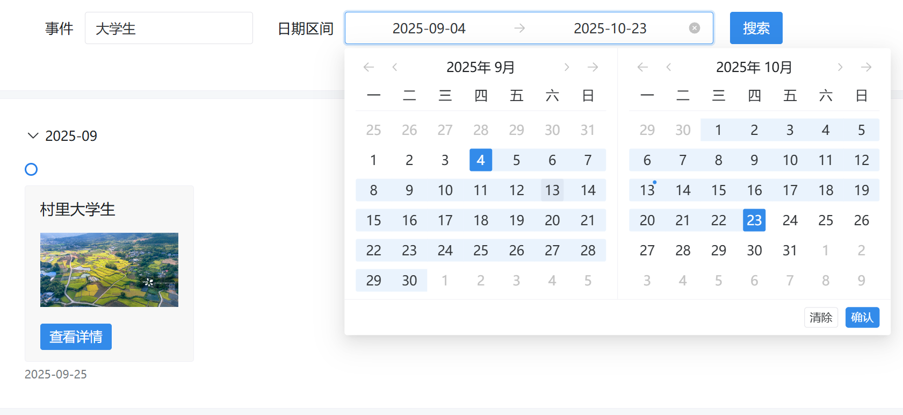

如果想清除搜索条件，将搜索条件删除，并点击搜索即可恢复。

#### 5.3 详情查看

点击“查看详情”浮窗显示事件图文；若含图片/视频，可直接预览或播放。

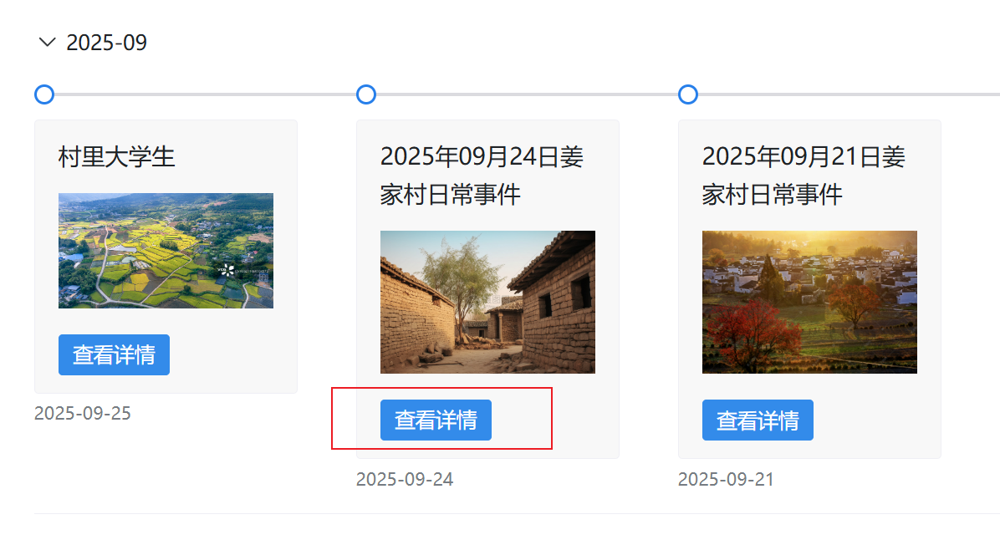

---

### 6 日历

日历以月历格形式呈现事件，点击具体日期弹出当日事件详细信息；支持前后月份切换。

---

### 7 大事纪管理

（仅管理员及超级管理员权限可见）

#### 7.1 列表操作

- 新建：点击“新建”进入编辑页，保存后置顶显示；
- 编辑：点击行尾“编辑”修改已有事件；
- 删除：点击行尾“删除”二次确认后移除。

#### 7.3 检索

与“大事纪展示”共用同一套关键词 + 日期区间检索逻辑。

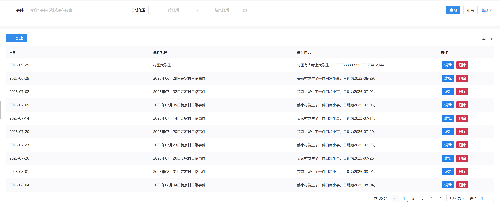

点击新建即可创建新的事件，最新创建的事件会排在最前面。编辑与删除分别对应的是编辑和删除功能。

点击新建或删除会进入以下页面，新建则是空白，编辑则会加载信息。

#### 7.2 富媒体

编辑器支持插入图片、上传视频。

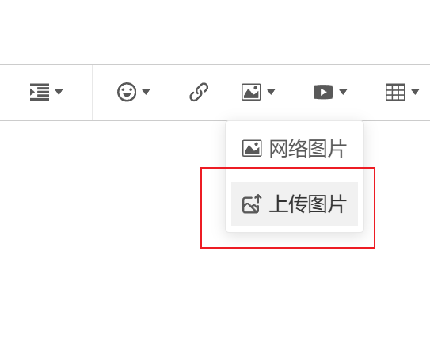

---

### 8 家谱管理

（仅管理员及以上权限可见）

#### 8.1 成员检索

可单独或组合输入“姓名 / 父亲姓名”进行模糊查询。

#### 8.2 生命周期

- 新建：红色星号项为必填；选择父亲时支持关键词搜索，列表显示“第几世 + ID”以防重名；
- 编辑：打开现有成员，修改后保存；
- 删除：仅允许删除无子节点成员，系统二次确认。

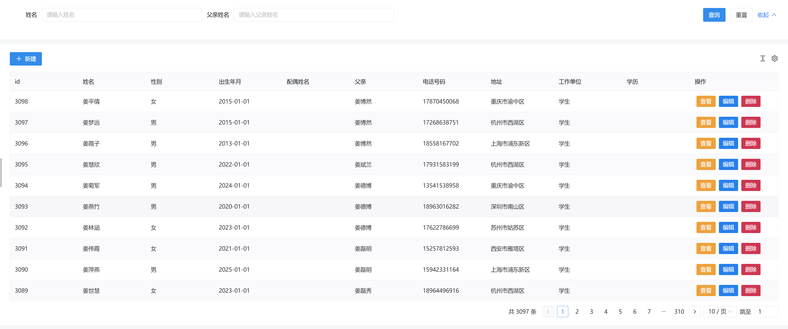

#### 8.3 信息管理

在选择父亲时，可以直接输入关键词进行搜索，考虑到可能有重名的可能，所有提供了其他信息参考。通过第几世以及姓名前面的id来确定具体是哪个人。而id可以在家谱管理中查看。

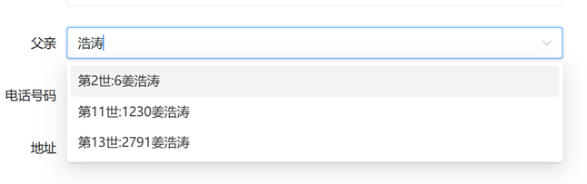

支持多附件上传；PDF/图片可在线预览，Word/Excel 类文件点击即下载。

在列表页点击“查看”可弹出该成员只读详情，含个人基础信息与附件列表。

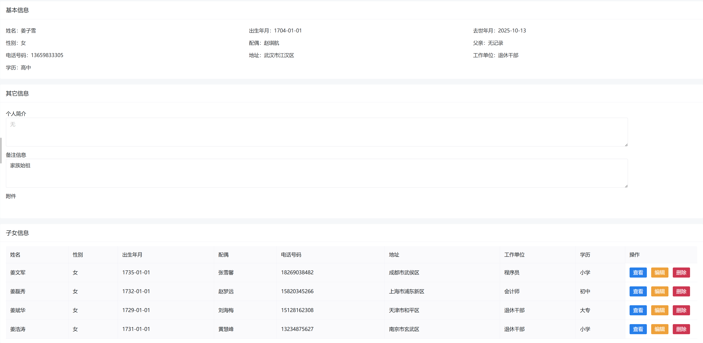

值得注意的是，删除功能不能删除有子女的人。

#### 8.4导入与导出功能

家谱管理支持一键批量导入、导出成员数据，兼顾高效与准确。

#### ⑴ 数据导入

在“家谱管理”顶部工具栏点击【导入数据】按钮，即可打开导入弹窗。

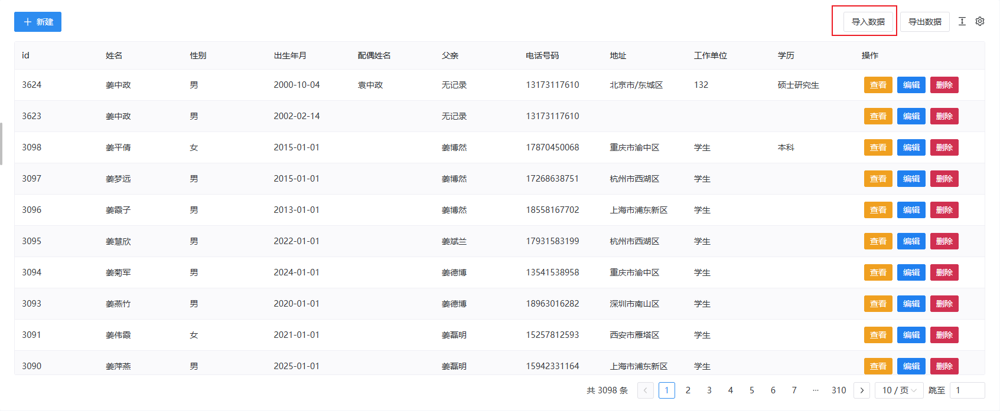

首次导入请先点击【下载模板】，本地得到一个标准 Excel 文件。模板表头已锁定，**请勿修改列名**，否则系统无法识别。
按示例格式填入成员信息后，**务必删除示例行**。

这里需要注意的是excel文件必须按照这样的格式

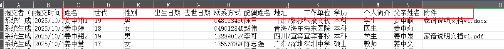

也可以使用腾讯文档的收集功能进行收集并导入。不过需要自己手动删除异常值。另外还要调整表头名字，**必须与前面写的表头名字一致，但是对顺序没有要求**。如下图

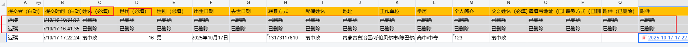

若成员资料含附件，需把全部附件压缩成 **无文件夹层级的 ZIP 包**。
推荐操作：选中文件 → 右键 →“发送到压缩(zipped)文件夹”。

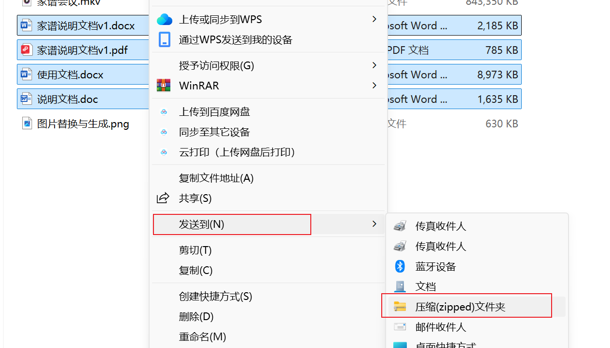

完成上述准备后，在弹窗内依次选择：

1. 填写好的 Excel
2. 附件 ZIP（可选）点击【上传】即开始导入。系统会在后台校验数据，异常项（如父亲重名、缺失）将自动进入“待处理”列表。

由于导入数据可能出现父亲重名的情况或者缺失父亲（父亲名输错没有找到父亲），进入待处理进行相关操作。异常数据全部在此页面，在此页面进行处理即可。点击编辑进行编辑，在编辑处选择完正确的父亲后，异常数据消失。

值得注意的是，这些数据实际上已经上传到数据库当中，因为找不到父亲所以不会在家谱树界面进行展示。

选择父亲

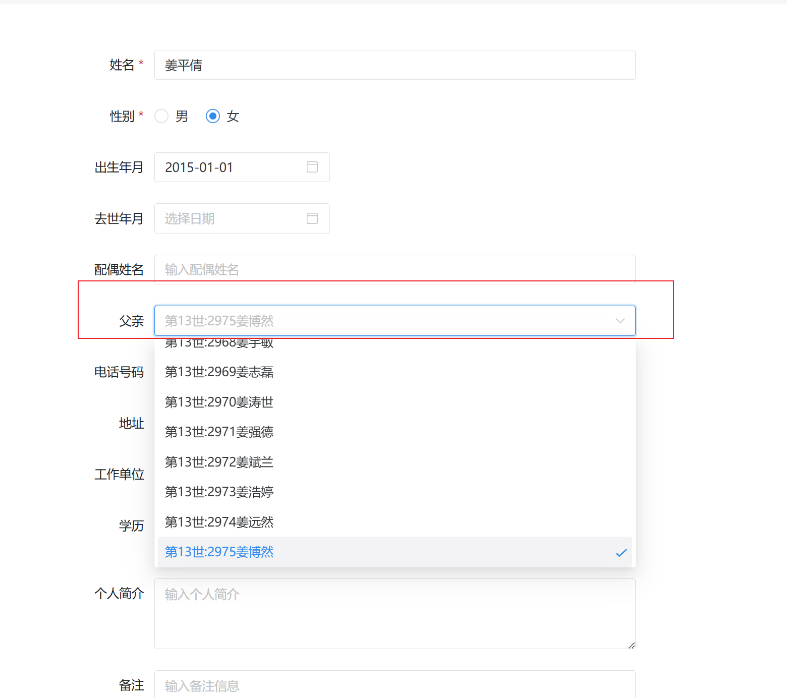

#### ⑵ 数据导出

点击同一行工具栏的【导出数据】按钮，浏览器立即下载 `家族成员信息及附件.zip`。解压后得到：

- `家族成员信息.xlsx` – 完整成员表
- `attachments/` – 所有已上传附件，按成员 ID 自动归类

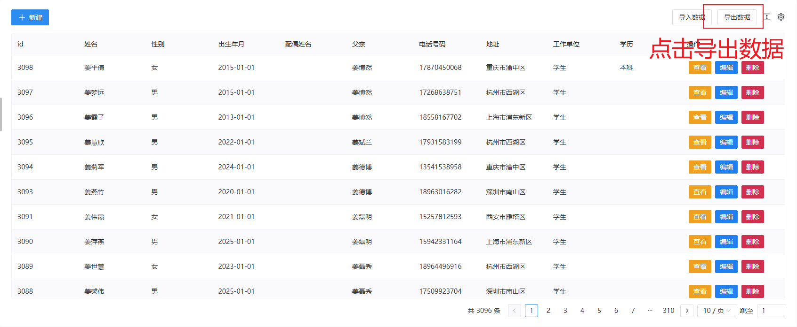

浏览器会自动下载

里面会包含一个excel文件以及附件

导出的 Excel 可直接用于备份、二次编辑，实现家谱数据的闭环管理。

---

### 9 用户管理

（仅超级管理员可见）

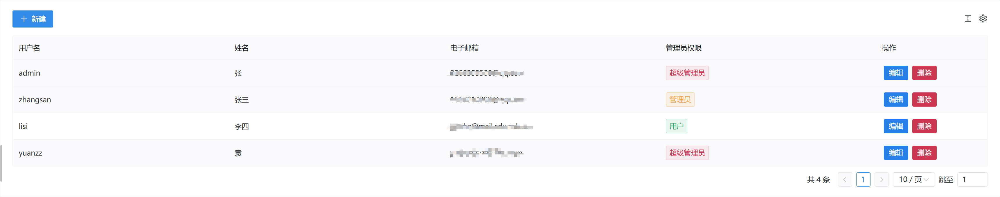

#### 9.1 角色权限

| 角色       | 权限范围                 |
| ---------- | ------------------------ |
| 普通用户   | 查看家谱树、大事纪、日历 |
| 管理员     | 上述 + 管理大事纪与家谱  |
| 超级管理员 | 上述 + 用户管理          |

#### 9.2 账号字段

- 用户名：登录凭证，全局唯一；
- 邮箱：用于找回密码；(非必填)
- 密码：创建/修改时需两次输入一致。

#### 9.3 维护操作

- 新建：填写必填项后保存；
- 编辑：可单独修改基础信息，留空密码项表示不更新密码；
- 删除：二次确认后即时生效，已删除账号不可恢复。

两次输入的密码必须一致才能提交。

修改用户信息时，只需要修改想要修改的信息即可。需要修改密码时填写密码，不需要时不需要填。

---

### 10 个人信息

点击页面右上角头像 →“个人信息”，可自助修改：

1. 姓名（显示昵称）；
2. 登录密码（需两次输入一致）；
3. 找回邮箱（用于密码重置）。

点击"更新基本信息"之后会提示再输入一遍密码，此密码为原密码，输入完成后，完成修改。

